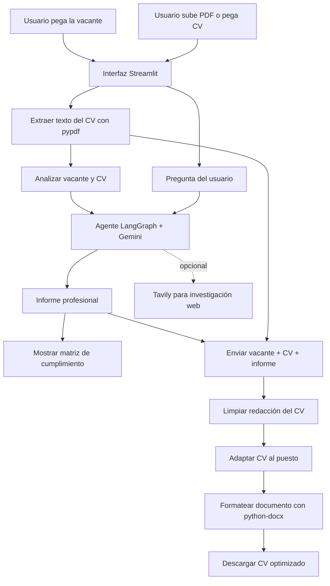

# Agente CV IA

Aplicación para analizar la compatibilidad entre una vacante y un CV, explicar los resultados de forma profesional, responder preguntas sobre ambas fuentes y generar un CV optimizado para el puesto.

El proyecto está pensado para un flujo de selección de personal: primero se entiende lo que solicita la vacante, después se compara con la información real del candidato y finalmente se prepara una versión del CV enfocada en esa postulación.

## Funcionalidades

- Carga de CV en formato PDF.
- Pegado manual del texto del CV.
- Comparación entre requisitos de la vacante y evidencia del CV.
- Informe profesional con veredicto, porcentaje estimado, matriz de cumplimiento, fortalezas, brechas, riesgos y recomendaciones.
- Preguntas y respuestas basadas en la vacante y el CV cargado.
- Limpieza de errores de extracción del PDF, palabras pegadas, tildes y espacios.
- Adaptación del CV al puesto objetivo sin inventar experiencia, empresas, cargos, fechas ni tecnologías.
- Generación de un documento Word descargable.
- Formato estructurado del CV: perfil, formación, experiencia y habilidades técnicas.
- Tamaño de letra de 12 puntos en el documento generado.
- Uso de Gemini para el análisis y para la optimización independiente del CV.

## Flujo general



## Cómo funciona el proyecto

### 1. Entrada de información

El usuario introduce la descripción de la vacante y el CV del candidato mediante un PDF o texto manual. El PDF se convierte a texto con `pypdf` y se limita antes de enviarse al modelo para evitar solicitudes excesivamente grandes.

### 2. Análisis de compatibilidad

El módulo `backend/agent.py` utiliza Gemini mediante LangChain y LangGraph. El agente recibe la vacante y el CV, y produce un informe dividido en:

1. Veredicto ejecutivo.
2. Porcentaje aproximado de adecuación.
3. Requisitos de la vacante frente al CV.
4. Fortalezas más importantes.
5. Brechas y riesgos.
6. Recomendaciones para CV, entrevista y postulación.
7. Resumen de empresa y rol, cuando existe información suficiente.
8. Conclusión final.

La sección de requisitos utiliza una matriz con cuatro columnas:

| Requisito evaluado | Estado | Evidencia encontrada en el CV | Brecha o impacto |
|---|---|---|---|
| Requisito del puesto | Cumple, cumple parcialmente o no se evidencia | Evidencia concreta | Interpretación para selección |

El sistema diferencia entre **cumple**, **cumple parcialmente** y **no se evidencia**. La última categoría no significa necesariamente que el candidato no tenga la habilidad; significa que el CV no la demuestra.

### 3. Preguntas sobre la candidatura

El usuario puede preguntar qué requisitos faltan, si conviene postularse o qué experiencia debe explicar en la entrevista. Cada respuesta consulta nuevamente la vacante y el CV para no basarse en una sola fuente.

### 4. Optimización del CV

El optimizador está separado del agente principal en `backend/cv_optimizer.py`.

La optimización ocurre en dos pasos:

1. **Limpieza:** corrige ortografía, tildes, espacios, palabras pegadas y errores de extracción del PDF. Elimina ruido, duplicados exactos, tablas rotas, símbolos extraños y Markdown.
2. **Adaptación:** recibe la vacante, el CV limpio y el informe de compatibilidad. Reposiciona el perfil profesional, prioriza habilidades y ordena responsabilidades según los requisitos del puesto.

El optimizador conserva la información factual del candidato. No debe inventar cargos, empresas, herramientas, años de experiencia, estudios, certificaciones ni logros.

La salida mantiene este formato:

```text
NOMBRE COMPLETO
CARGO PROFESIONAL
TELÉFONO | CORREO | ENLACE

PERFIL PROFESIONAL
...

FORMACIÓN ACADÉMICA Y COMPLEMENTARIA
...

EXPERIENCIA PROFESIONAL
...

HABILIDADES TÉCNICAS
...
```

El documento se crea con `python-docx`, tiene márgenes profesionales, secciones claras y tamaño de texto de 12 puntos.

## Arquitectura del proyecto

```text
Langchain/
├── backend/
│   ├── __init__.py
│   ├── agent.py
│   └── cv_optimizer.py
├── frontend/
│   ├── __init__.py
│   └── web_app.py
├── PDFs/
├── .env
├── .env.example
├── .gitignore
├── requirements.txt
└── README.md
```

### `frontend/web_app.py`

Contiene la interfaz Streamlit, los campos de entrada, la visualización del informe, las preguntas, la generación del Word y el estado de sesión mediante `st.session_state`.

### `backend/agent.py`

Contiene la configuración de Gemini para análisis y preguntas, la herramienta Tavily, la extracción de PDF, los prompts de comparación, la memoria de conversación con `InMemorySaver` y la normalización de respuestas del modelo.

### `backend/cv_optimizer.py`

Contiene el LLM independiente del CV, la limpieza de redacción, la adaptación a la vacante, el uso del informe como tercer contexto, la generación del `.docx` y el respaldo con el CV original si el proveedor falla.

## Tecnologías utilizadas

| Tecnología | Uso en el proyecto |
|---|---|
| Python | Lenguaje principal del backend |
| Streamlit | Interfaz web interactiva |
| Gemini | Análisis, preguntas y optimización del CV |
| LangChain | Integración con modelos y herramientas |
| LangGraph | Agente con memoria y flujo de mensajes |
| Tavily | Búsqueda web opcional sobre empresas o puestos |
| pypdf | Lectura de texto desde CVs PDF |
| python-docx | Creación y formato del Word descargable |
| python-dotenv | Carga de variables desde `.env` |

## Requisitos

- Python 3.11 o superior recomendado.
- Una clave de Gemini.
- Una clave de Tavily si se desea investigación web.
- Git opcional para versionar el proyecto.

## Configuración local

### 1. Crear o activar el entorno virtual

En Windows PowerShell:

```powershell
python -m venv .venv
.\.venv\Scripts\Activate.ps1
```

### 2. Instalar dependencias

```powershell
.\.venv\Scripts\python.exe -m pip install -r requirements.txt
```

### 3. Crear el archivo `.env`

Copiar `.env.example` como `.env` y completar las claves localmente:

```env
GEMINI_API_KEY=tu_clave_de_gemini
GEMINI_MODEL=gemini-3.1-flash-lite-preview
TAVILY_API_KEY=tu_clave_de_tavily
```

No subir `.env` al repositorio. El archivo está excluido por `.gitignore`.

### 4. Ejecutar la aplicación

```powershell
.\.venv\Scripts\python.exe -m streamlit run frontend\web_app.py --server.address 127.0.0.1 --server.port 8501
```

Abrir en el navegador: `http://127.0.0.1:8501`.

## Uso recomendado

1. Pegar la descripción completa de la vacante.
2. Subir el CV en PDF o pegar su texto.
3. Pulsar **Analizar vacante vs CV**.
4. Leer el informe y revisar la matriz de cumplimiento.
5. Hacer preguntas concretas sobre la candidatura.
6. Pulsar **Generar Word optimizado**.
7. Descargar el documento generado.

El CV debe revisarse antes de enviarlo. La aplicación ayuda a mejorar la redacción y el enfoque, pero la persona candidata debe confirmar que cada dato sea verdadero.

## Seguridad

- Nunca subir `.env`.
- Nunca colocar claves reales en `README.md`, capturas, código o logs.
- Usar `.env.example` solo como plantilla sin secretos.
- Si una clave se expone, revocarla inmediatamente y generar una nueva.
- Los PDFs personales están excluidos mediante `.gitignore`.
- Los archivos Word generados y temporales también se excluyen.

## Validaciones técnicas

Para comprobar la sintaxis:

```powershell
.\.venv\Scripts\python.exe -m py_compile backend\agent.py backend\cv_optimizer.py frontend\web_app.py
```

Para comprobar imports:

```powershell
.\.venv\Scripts\python.exe -c "import backend.agent; import backend.cv_optimizer; print('IMPORTS_OK')"
```

## Limitaciones conocidas

- La calidad depende de la claridad de la vacante y del texto extraído del CV.
- Un PDF escaneado como imagen puede requerir OCR.
- La clasificación de adecuación es una estimación, no una decisión automática de contratación.
- Gemini puede devolver estructuras distintas; el proyecto normaliza esas respuestas.
- Tavily es opcional y requiere una clave válida.
